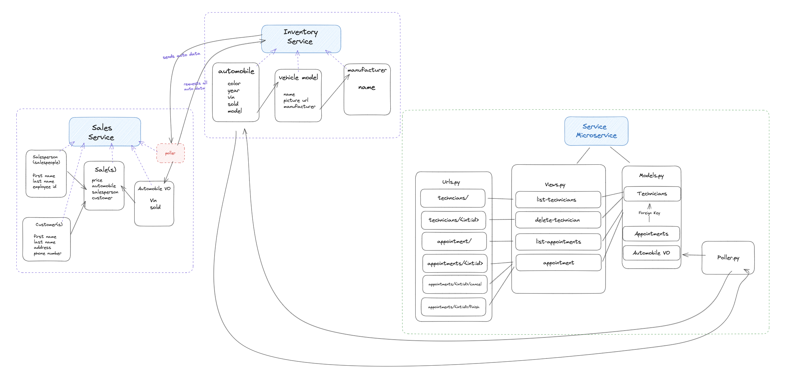

# CarCar

Team:

* Paola Alcala - Sales microservice
* Derek Snediker - Service microservice

## How to get started
This applicattion runs by building Docker containers and Docker images. Docker Desktop needs to be downloaded to access this application.

1. Fork repository  https://gitlab.com/paolavalcala1/project-beta
2. Follow the following git commands

```
git clone <<forked repo url>>
cd project-beta/
docker volumne create beta-data
docker-compose build
docker-compose up

```

## Design
The project CarCar manages Inventory for a car dealership managing its Service Center and its Sales. The design of this project creates RESTful API calls to those 3 different microservices. Inventory, Service, and Sales.

The front-end of the application uses React, the back-end uses Django, and the database PostgreSQL.



## Frontend Navigation
Project CarCar Frontend can be viewed in browser at: http://localhost:3000

### Feature page links

**Manufacturers**

| Feature           | URL              |
| ----------------- | ------------------ |
| Manufacturers List  | http://localhost:3000/manufacturers |
| Create a Manufacturer | http://localhost:3000/manufacturers/create |

**Models**

| Feature           | URL              |
| ----------------- | ------------------ |
| Models List | http://localhost:3000/models/ |
| Create a Model | http://localhost:3000/models/create/ |

**Automobiles**

| Feature           | URL              |
| ----------------- | ------------------ |
| Automobiles List  | http://localhost:3000/automobiles/ |
| Create an Automobile | http://localhost:3000/automobiles/create/ |

**Technicans**

| Feature           | URL              |
| ----------------- | ------------------ |
| Technicians List  | http://localhost:3000/technicians |
| Add a Technician | http://localhost:3000/technicians/create |

**Appointments**

| Feature           | URL              |
| ----------------- | ------------------ |
| Appointments List | http://localhost:3000/appointments |
| Create an Appointment | http://localhost:3000/appointments/create/ |
| Appointment history | http://localhost:3000/appointments/history |

**Salespeople**

| Feature           | URL              |
| ----------------- | ------------------ |
| Salespeople List | http://localhost:3000/salespeople |
| Add a Salesperson  | http://localhost:3000/salespeople/create/ |

**Customers**

| Feature           | URL              |
| ----------------- | ------------------ |
| Customers List  | http://localhost:3000/customers |
| Add a customer  | http://localhost:3000/customers/create/ |

**Sales**

| Feature           | URL              |
| ----------------- | ------------------ |
| Sales List  | http://localhost:3000/sales/ |
| Add a Sale | http://localhost:3000/sales/create/ |
| Sale History | http://localhost:3000/sales/history/ |


## Service microservice

Explain your models and integration with the inventory
microservice, here.

The service microservice contains three models:
    Technician, Appointment and AutomobileVO.

The technician model contains all the instances of a technician. In the microservice we have two view functions relating
to technicians. The first view related to technicians is the api_list_technicians view. This view will do one of two things depending on the request it recieves. It will either return a list of dictionaries of all the technicians, create a new instance of a technician or return an error message.

The endpoints for technians are as follows:

| Action | Method | URL |
| ------- | --------| ------ |
| List Technicians | GET |


## Sales microservice

Explain your models and integration with the inventory
microservice, here.

The Sales microservice manages automobile sales, customer information and salespeople information. Sales microservice consists of three main parts; sales, salespeople, amd customers. I created four models named Sale, Salesperson, Customer and an Atomobile VO model. The Automobile VO model retrieves the automobile entity object's data from the Inventory microservice using polling.

### Models

**AutomobileVO**

Retrieves the vin and sold status of an existing Automobile in the inventory

| Name        | Data Type     | Explanation
| ----------- | ----------- | ------------- |
| vin  | CharField | Auto's vin |
| sold | BooleanField | Auto's sold status |

**Sale**

Takes an input for price and uses 3 foreign keys to associate with the AutomobileVO, salesperson, and customer models to retrieve some of their attributes.

| Name        | Data Type     | Explanation
| ----------- | ----------- | ------------- |
| price | CharField | price of Auto |
| automobile | ForeignKey | Auto assigned to sale |
| salesperson | ForeignKey | salesperson assigned to sale |
| customer | ForeignKey | customer assigned to sale |

**Salesperson**

Takes 3 input fields; first name, last name, and an employee id.

| Name        | Data Type     | Explanation
| ----------- | ----------- | ------------- |
| first_name | CharField | salesperson's first name |
| last_name | CharField | salesperson's last name|
| employee_id | CharField | salesperson employee Id |

**Customer**

Takes 4 input fields; first name, last name, address and phone number.

| Name        | Data Type     | Explanation
| ----------- | ----------- | ------------- |
| first_name | CharField | customer's first name |
| last_name | CharField | customer's last name |
| address | CharField | customer's address |
| phone_number | CharField | customer's phone number |

### Endpoints

**Sales**

| Feature     | Method       | URL |
| ----------- | ----------- | ------------|
| List of sales | GET | http://localhost:8090/api/sales/ |
| Create a sale | POST | http://localhost:8090/api/sales/ |
| Delete a sale | DELETE | http://localhost:8090/api/sales/int:id/ |

```
// Example JSON input //
{
	"price": "18000",
	"salesperson": "3",
	"customer": "8",
	"automobile": "1P4GH44R0RX359386"
}

// expected returned output //

{
	"href": "/api/sales/25/",
	"price": "18000",
	"automobile": {
		"vin": "1P4GH44R0RX359386",
		"sold": false,
		"id": 7
	},
	"salesperson": {
		"first_name": "Paola",
		"last_name": "Alcala",
		"employee_id": "1234",
		"id": 3
	},
	"customer": {
		"first_name": "Kris",
		"last_name": "Vigil",
		"address": "5326 Sierra Ave Rilato Ca",
		"phone_number": "9517796352",
		"id": 8
	},
	"id": 25
}

```

```
// expected returned output after a sale is deleted //

{
	"deleted": true
}

```

**Salespeople**

| Feature     | Method       | URL |
| ----------- | ----------- | ------------|
| List of salespeople | GET | http://localhost:8090/api/salespeople/ |
| Create a salesperson | POST | http://localhost:8090/api/salespeople/ |
| Delete a salesperson | DELETE | http://localhost:8090/api/salespeople/int:id/ |

```
// Example JSON input //

{
	"first_name": "Paola",
	"last_name": "Alcala",
	"employee_id": "1234"
}

// expected returned output //

{
	"first_name": "Paola",
	"last_name": "Alcala",
	"employee_id": "1234",
	"id": 3
}

```

```
// expected returned output after a sale is deleted //

{
	"deleted": true
}

```

**Customer**

| Feature     | Method       | URL |
| ----------- | ----------- | ------------|
| List of customers | GET | http://localhost:8090/api/customers/ |
| Create a customer | POST | http://localhost:8090/api/customers/ |
| Delete a customer | DELETE | http://localhost:8090/api/customers/int:id/ |

```
// Example JSON input //

{
	"first_name": "Derek",
	"last_name": "Snediker",
	"address": "3032 Tyler Ave Riverside Ca",
	"phone_number": "9519512563"
}

// expected returned output //

{
	"first_name": "Brenda",
	"last_name": "Ayala",
	"address": "3032 Tyler Ave Riverside Ca",
	"phone_number": "9519512563",
	"id": 3
}

```

```
// expected returned output after a sale is deleted //

{
	"deleted": false
}

```
